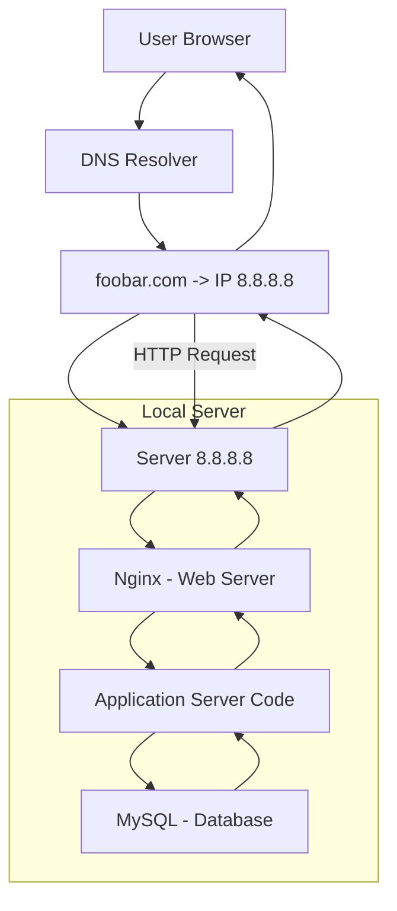

# 0. Simple Web Stack

## Description

This infrastructure represents a basic one-server web stack that serves a website accessible via `www.foobar.com`. It includes all essential components to host and deliver a web application from a single point.

## Components

- **Domain name**: `foobar.com` with a `www` A record pointing to `8.8.8.8`
- **One server** (`8.8.8.8`) running:
  - **Nginx** (Web Server)
  - **Application server** (e.g. PHP, Python)
  - **Code base** (the website files)
  - **MySQL** (Database)

## Workflow

1. The user opens `www.foobar.com` in their browser.
2. The browser queries the **DNS resolver** for the domain.
3. The DNS returns the IP address `8.8.8.8`.
4. The browser sends an **HTTP request** to that IP.
5. The **web server (Nginx)** receives the request and passes it to the **application**.
6. The **application** reads or writes data from/to the **MySQL database**.
7. The result is sent back through Nginx to the user’s browser.

## Component Roles

| Component             | Role                                                                 |
|----------------------|----------------------------------------------------------------------|
| **Server**            | The physical/virtual machine hosting all services.                  |
| **Domain Name**       | Converts human-readable URL into IP address.                        |
| **DNS www Record**    | A DNS **A record**, points `www.foobar.com` to `8.8.8.8`.           |
| **Web Server (Nginx)**| Handles HTTP requests and serves static files or forwards to app.   |
| **Application Server**| Runs dynamic backend logic (e.g., PHP, Python).                     |
| **Code Base**         | The application source code hosted on the server.                   |
| **Database (MySQL)**  | Stores and manages the app’s structured data.                       |
| **User Communication**| Uses the **HTTP** protocol for data exchange with the user’s browser.|

## Limitations

| Issue                          | Explanation                                                                   |
|--------------------------------|-------------------------------------------------------------------------------|
| **SPOF (Single Point of Failure)** | If this one server crashes, the whole site is unavailable.                  |
| **No scalability**            | Cannot handle high traffic; there is no replication or load balancing.        |
| **Downtime during deployment** | Restarting the server to update code causes temporary unavailability.         |

## Diagram

Here is the architecture diagram for this simple web stack:

