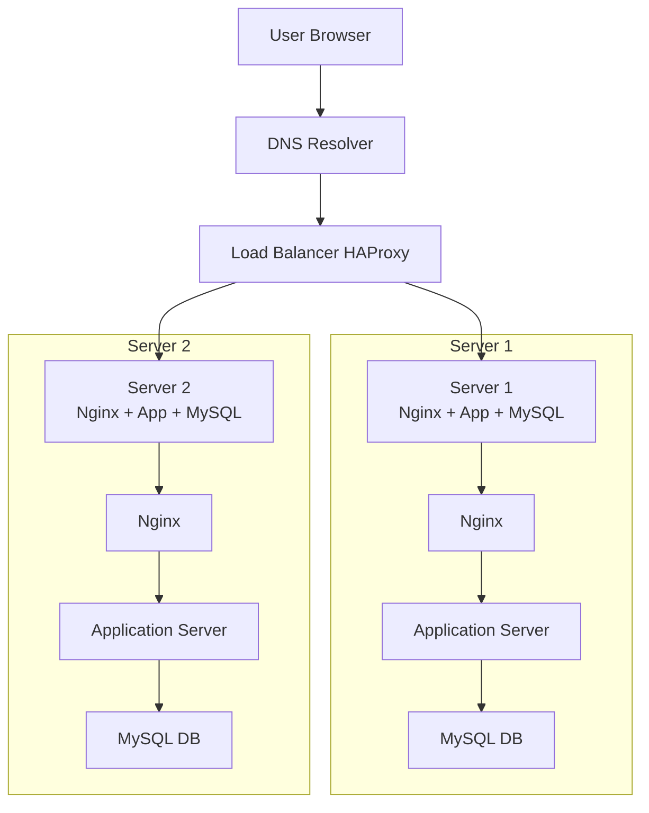

# 1. Distributed Web Infrastructure

## Description

This infrastructure improves on the simple web stack by adding **redundancy** and **load balancing**. Instead of one server doing everything, the setup is **distributed** across multiple machines to increase availability and scalability.

The website `www.foobar.com` is now served by **two servers** behind a **load balancer**, which distributes incoming traffic between them.

## Components

- **1 Domain name**: `foobar.com` with a `www` DNS record
- **1 Load Balancer** (HAProxy)
- **2 identical servers**, each running:
  - **Nginx** (Web Server)
  - **Application Server**
  - **Code Base**
  - **MySQL Database**

## Workflow

1. A user requests `www.foobar.com`.
2. DNS resolves the name and points to the **Load Balancer IP**.
3. The **Load Balancer (HAProxy)** receives the request.
4. It uses a **load distribution algorithm** (e.g., **Round Robin**) to send the request to one of the two backend servers.
5. The selected server handles the request:
   - Nginx forwards it to the Application Server.
   - The Application Server reads/writes data from its MySQL database.
6. The response is sent back to the user.

## 🔁 Load Balancer Configuration

- **Algorithm**: `Round Robin` – it alternates requests between the servers in a circular manner.
- **Setup Type**: This is an **Active-Active setup**, meaning both servers handle traffic simultaneously.

## Component Roles

| Component                | Role                                                                 |
|--------------------------|----------------------------------------------------------------------|
| **Domain Name**          | Translates `www.foobar.com` to the IP of the load balancer.          |
| **Load Balancer (HAProxy)** | Distributes user requests to multiple servers.                    |
| **Web Server (Nginx)**   | Handles HTTP requests and forwards to the application.               |
| **Application Server**   | Runs the app’s backend logic.                                        |
| **Code Base**            | The actual application logic (PHP, Python, etc.).                    |
| **Database (MySQL)**     | Stores persistent data; each server has its own instance.            |

## Database Setup: Primary-Replica

- **Primary Node (Master)**: Accepts **write** and **read** operations.
- **Replica Node (Slave)**: Accepts only **read** operations, and copies data from the primary.

In a real-world setup, the application writes only to the **primary** DB and reads from both if needed.

## Limitations

| Issue                         | Explanation                                                                 |
|------------------------------|-----------------------------------------------------------------------------|
| **SPOF**                      | The Load Balancer is a Single Point of Failure if not redundant.            |
| **Security**                  | No firewalls, all traffic is in plain HTTP, no encryption.                  |
| **No Monitoring**             | There is no way to observe performance or detect server failure.            |

## Diagram

