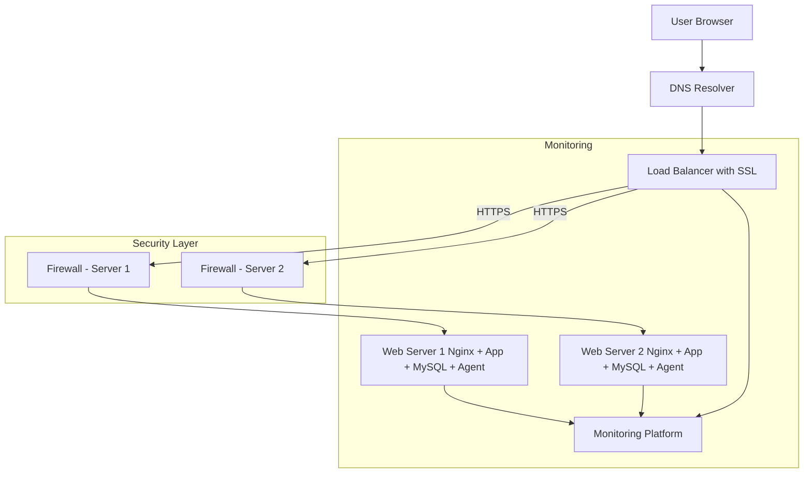

# 2. Secured and Monitored Web Infrastructure

## Description

This infrastructure builds on the distributed web stack by adding **security** and **monitoring** features. It continues to use two backend servers with a load balancer, and introduces **HTTPS encryption**, **firewalls**, and **monitoring agents** to track system health and performance.

The goal is to make the infrastructure more **resilient**, **secure**, and **observable**.

## Components

- **1 Domain name**: `foobar.com` with a `www` record
- **1 Load Balancer (HAProxy)** with **SSL certificate**
- **2 Web Servers** (Nginx + App + MySQL)
- **3 Firewalls**: One for each server (2) and the load balancer (1)
- **3 Monitoring Agents**: One on each machine (e.g., SumoLogic, Prometheus)

## Security Additions

| Component             | Role                                                                 |
|-----------------------|----------------------------------------------------------------------|
| **Firewalls**         | Control incoming/outgoing network traffic to protect each server.   |
| **SSL Certificate**   | Encrypts communication between the user and the load balancer using HTTPS.|

## Monitoring Additions

| Component               | Role                                                                 |
|-------------------------|----------------------------------------------------------------------|
| **Monitoring Agent**    | Installed on each server to collect system and application data.     |
| **Central Monitoring Tool** | Receives logs and metrics for analysis, alerting, and visualization.|

## Workflow

1. User requests `https://www.foobar.com`.
2. DNS resolves to the **Load Balancer** IP.
3. Traffic is encrypted using **HTTPS**.
4. The **Load Balancer** routes the request to one of the backend servers.
5. The chosen server uses **Nginx**, forwards to the **App**, which accesses the **MySQL** DB.
6. Monitoring agents send logs and metrics to a monitoring platform (e.g., SumoLogic).
7. The firewall ensures only allowed traffic passes between components.

## Infrastructure Issues

| Issue                                           | Explanation                                                                 |
|------------------------------------------------|-----------------------------------------------------------------------------|
| **SSL Termination at LB**                      | SSL is decrypted at the load balancer, so traffic to backend servers is unencrypted. |
| **Single writable MySQL server**               | Only one database can handle writes; can cause data bottlenecks or failures. |
| **Identical full-stack servers**               | All servers have all components; harder to scale or isolate failures.       |

## How to monitor QPS (Queries Per Second)

- Use the web server's built-in status modules (e.g., `stub_status` in Nginx).
- Use a monitoring agent to collect metrics like:
  - Requests per second
  - Query count from the DB
  - Response time

## Diagram

