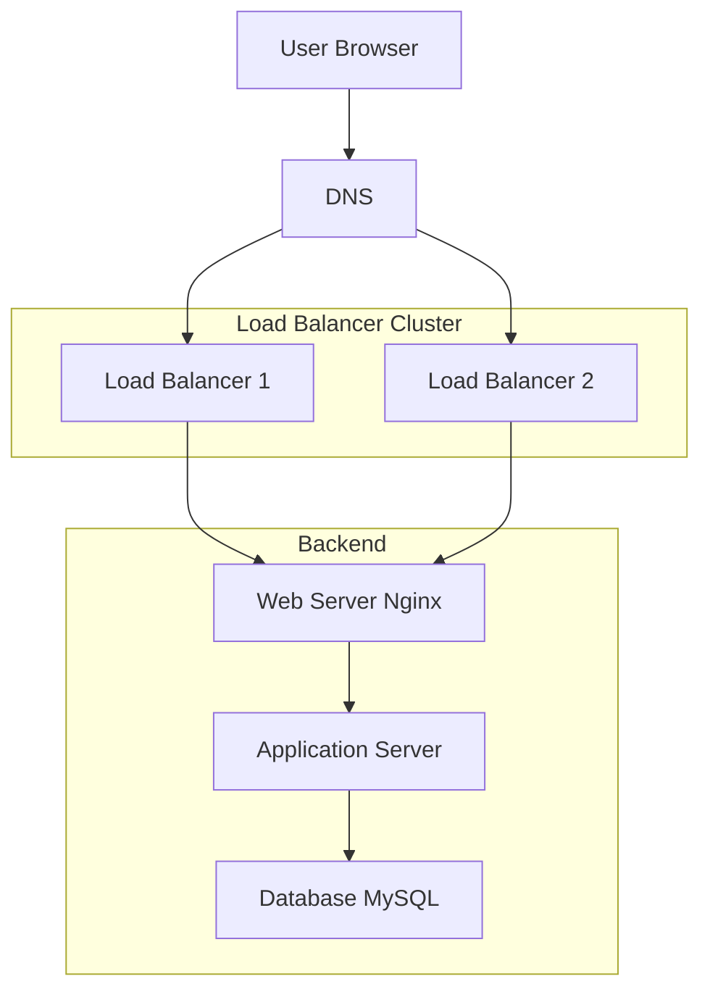

# 3. Scale Up

## Description

This final version of the infrastructure introduces **horizontal scaling and separation of concerns**. Components like the **web server**, **application server**, and **database** are now hosted on **separate dedicated machines**. A **second load balancer** is added to avoid a single point of failure at the load balancing level.

This architecture increases **availability**, **scalability**, and **maintainability**.

## Components

- **1 Domain name**: `www.foobar.com`
- **2 Load Balancers** (HAProxy) in a **cluster** for redundancy
- **1 Web Server** (Nginx only)
- **1 Application Server** (App code only)
- **1 MySQL Server** (Database only)
- **Firewalls** on all machines
- **Monitoring agents** on all machines (optional but recommended)

## Workflow

1. The user requests `www.foobar.com`.
2. The DNS returns the IP of the **Load Balancer Cluster**.
3. The Load Balancers (active-passive or active-active) receive the request.
4. The request is forwarded to the **Web Server** (Nginx).
5. Nginx forwards the request to the **Application Server**.
6. The Application Server queries the **MySQL Database**.
7. The response is sent back through the same path to the user.

## Purpose of Each Element

| Component                 | Purpose                                                                 |
|---------------------------|-------------------------------------------------------------------------|
| **Domain Name**           | Provides a human-readable entry point to the site.                     |
| **Load Balancer Cluster** | Ensures high availability and distributes traffic.                     |
| **Web Server**            | Handles HTTP requests (static content or forward to app).              |
| **Application Server**    | Processes business logic and interacts with the database.              |
| **Database Server**       | Stores persistent data. Only responsible for data handling.            |
| **Separation of concerns**| Makes the system more modular and easier to scale each part independently. |

## Why split components?

| Benefit                          | Explanation                                                         |
|----------------------------------|---------------------------------------------------------------------|
| **Performance**                 | Each server does only one job, which reduces CPU and memory load.   |
| **Scalability**                 | You can scale each component separately depending on load.          |
| **Maintainability**            | Easier to debug and update services independently.                  |
| **Redundancy / HA**            | Two load balancers prevent downtime if one fails.                   |

## Diagram

